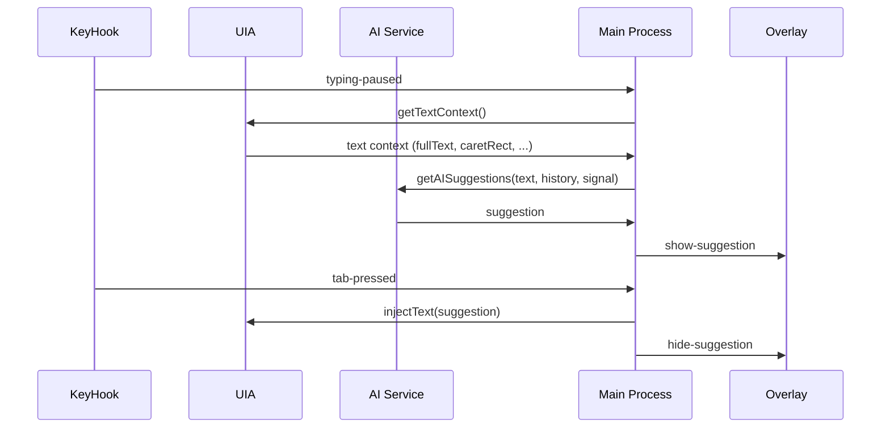

# Architecture

This document explains how Verbo Typing Intelligence works end-to-end: global input hooks, Windows UI Automation (UIA), AI suggestion generation, and the on-screen overlay.

## Components
1. Electron main process (`electron/main.ts`)
2. Global keyboard/mouse hook (`electron/hook.ts`)
3. Windows UI Automation bridge (`electron/uia.ts`)
4. AI provider selection + text generation (`src/services/ai.ts`)
5. Preload IPC bridge (`electron/preload.ts`)
6. Renderer UI
   - Configuration window (`src/App.tsx`)
   - Overlay (`src/Overlay.tsx`)

## High-level flow

```mermaid
flowchart TD
  A[Global input hook (KeyHook)] --> B[Typing paused event]
  B --> C[UI Automation: getTextContext()]
  C --> D[AI: getAISuggestions()]
  D --> E[Main process: position + send suggestion to overlay]
  E --> F[Overlay renderer shows suggestion]
  F --> G[Tab pressed event]
  G --> H[UI Automation: injectText()]
  H --> I[Hide overlay]
```

## Step-by-step runtime behavior

### 1) App start (Electron main)
In `electron/main.ts`, Electron waits for readiness:
- `createWindow()` creates the main app window (your “Configurations” UI).
- `createOverlayWindow()` creates a transparent overlay window for displaying the ghost text.
- On Windows, `app.setAppUserModelId('com.verbo.typingintelligence')` is set for correct taskbar grouping/icon behavior.
- The app initializes:
  - UIA bridge: `uia.init()`
  - Global key hook: `keyHook.start()`
  - Configuration-driven enabling: if `processingEnabled`, `apiKey`, and `model` exist, the hook stays enabled.

### 2) Global key hook (`electron/hook.ts`)
The hook uses `uiohook-napi`:
- On every `keydown`, it emits a `keypress` event immediately (used to hide the overlay when typing resumes).
- It debounces input using `debounceMs = 400`.
- After typing pauses, it emits `typing-paused`.
- It also has special events:
  - `tab-pressed` (keycode `15`): accept suggestion and inject text
  - `esc-pressed` (keycode `1`): hide and reject suggestion
  - `mousedown`: hide overlay and abort any in-flight AI request

### 3) UI Automation bridge (`electron/uia.ts`)
UI Automation is implemented using a persistent PowerShell process:
- `uia.init()` creates a PowerShell script in the OS temp directory:
  - `os.tmpdir()/verbo-uia-bridge.ps1`
- The script uses .NET UI Automation APIs to:
  - find the focused element
  - extract text via `TextPattern` (DocumentRange) or fallback to `ValuePattern`
  - extract caret/selection rectangle bounds
- Communication protocol:
  - Renderer/main sends `GET\n` to request a context payload
  - Renderer/main sends `INJECT|<escaped-text>\n` to inject keystrokes
  - Responses are emitted as JSON lines (`ConvertTo-Json -Compress | Write-Host`)

Key method mapping:
- `getTextContext()` returns:
  - `fullText`
  - `controlType`
  - `processName` (currently populated from `target.Current.ClassName`)
  - optional `caretRect` (when selection/caret bounds are valid)
- `injectText(text)` calls `SendKeys.SendWait(...)` from PowerShell.

### 4) AI suggestion generation (`src/services/ai.ts`)
The AI service:
- Selects provider based on `config.model` prefix:
  - `gemini-*` -> Google Gemini
  - `gpt-*` / `o1*` / `o3*` -> OpenAI
  - `claude-*` -> Anthropic
- Builds a short history from recent suggestion attempts (`history.slice(-5)`).
- Uses a “Ghost Writer” system instruction with strict rules:
  - never answer questions
  - return ONLY the predicted continuation
  - maintain style/tone of input
- Runs `generateText(...)` from `ai` and returns `suggestion` (cleaned) and optional `reasoning`.
- Supports cancellation via `AbortSignal` (used when the user types again or UIA focus changes).

### 5) Overlay rendering (`src/Overlay.tsx` + `src/Overlay.css`)
The overlay renderer:
- Listens for IPC events from the main process:
  - `show-suggestion`
  - `hide-suggestion`
- When a suggestion is present, it renders a pill-like text bubble styled for readability.

The overlay positioning:
- In `electron/main.ts`, when a caret rectangle is available, `overlayWin.setBounds(...)` positions the overlay near the caret.

### 6) IPC boundary (`electron/preload.ts`)
The preload script exposes a small API to the renderer using `contextBridge`:
- window controls:
  - `minimize`, `maximize`, `close`
- configuration:
  - `saveConfig`, `getConfig`

Overlay events are passed using `window.ipcRenderer` listeners (set up inside renderer components).

## Configuration UI (`src/App.tsx`)
The “Configurations” UI:
- collects `apiKey`, `model`, and `processingEnabled`
- uses `electron-store` persisted values (through `ipcMain` handlers)
- updates whether the global key hook should run:
  - enabled only if `processingEnabled && apiKey && model` are truthy

## Mermaid: event/interaction sequence



## Notes / limitations
- The UI Automation bridge is Windows-focused.
- The focused element detection may vary by application type; suggestions depend on having a readable focused text control.

