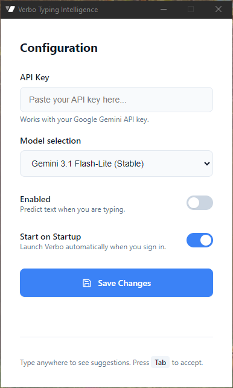
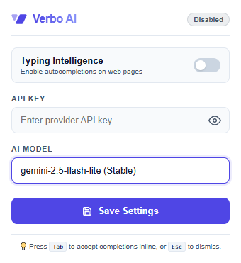
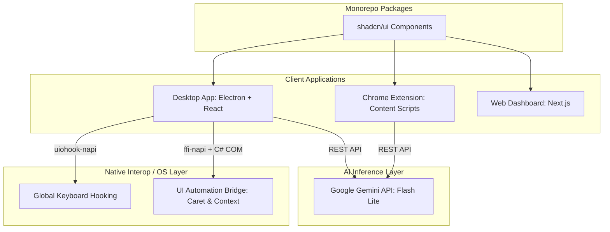

#  Verbo Typing Intelligence

<p align="center">
  
  
</p>

<p align="center">
  <b>A lightning-fast, context-aware inline typing assistant powered by Google Gemini AI across Windows OS and Web Browsers.</b>
</p>

<p align="center">
  <a href="#features">Features</a> •
  <a href="#architecture">Architecture</a> •
  <a href="#getting-started">Getting Started</a> •
  <a href="#development-workflow">Development Workflow</a> •
  <a href="#contributing">Contributing</a> •
  <a href="#license">License</a>
</p>

---

## 🌟 Overview

**Verbo Typing Intelligence** is an advanced inline predictive typing companion designed to accelerate your writing workflow. Whether you are drafting an email in Microsoft Outlook, writing documentation in a desktop markdown editor, or filling out text areas on the web, Verbo seamlessly monitors your text context and provides highly relevant, real-time continuation suggestions directly at your cursor.

With a single press of `TAB`, suggestions are instantly injected into your active application.

---

## ⚡ Key Features

### 🖥️ Windows Desktop Assistant (`apps/desktop`)
- **System-Wide Compatibility:** Works seamlessly across any Windows desktop application (Word, Notepad, VS Code, Discord, Slack, Outlook).
- **Precise Caret Tracking:** Integrates robust Windows UI Automation (UIA) COM bridges to track real-time cursor screen coordinates and text context.
- **Floating Ghost Text Overlay:** Displays a frictionless, transparent overlay showing AI predictions directly ahead of your typing cursor.
- **Low-Latency Global Key Hook:** Intercepts typing pauses to trigger predictions and handles `TAB` acceptance or `ESC` dismissal without stealing focus.

### 🌐 Chrome Extension Assistant (`apps/chrome-extension`)
- **Universal Browser Support:** Automatically attaches to standard `<input>`, `<textarea>`, and modern `contenteditable` editors across web pages.
- **Elegant Inline Suggestion Pills:** Renders beautiful, non-intrusive floating suggestion badges beneath the active input field.
- **Smart Formatting & Spacing:** Cleans up generated continuations to maintain correct grammar and natural spacing.

---

## 🏗️ Architecture

Verbo Typing Intelligence operates as a highly modular Turborepo monorepo connecting client applications with Google Gemini AI models.



---

## 🚀 Getting Started

### Prerequisites
- **Node.js**: v20 or higher
- **Package Manager**: `pnpm` (v9.15.9+)
- **OS**: Windows (required for desktop app development due to Windows UIA & native hooks)
- **C++ Build Tools**: Visual Studio C++ Build Tools & Python (for compiling `uiohook-napi` and `ffi-napi`)

### 1. Clone & Setup
Fork the repository on GitHub, then clone your fork locally:

```bash
git clone https://github.com/<your-username>/verbo-typing-intelligence.git
cd verbo-typing-intelligence

# Add upstream remote
git remote add upstream https://github.com/lwshakib/verbo-typing-intelligence.git
```

### 2. Install Dependencies
Run `pnpm install` from the root directory to install all monorepo packages and build native modules:

```bash
pnpm install
```

### 3. Configure API Key
When launching the Desktop App or Chrome Extension for the first time, open the settings configuration panel and input your **Google Gemini API Key**.

---

## 💻 Development Workflow

To start all development servers concurrently (Web Dashboard, Desktop App, and Chrome Extension watcher):

```bash
pnpm dev
```

### Running Specific Applications
You can filter tasks using Turborepo flags:

```bash
# Run only the Desktop Electron App
pnpm turbo run dev --filter=desktop

# Run only the Chrome Extension builder
pnpm turbo run dev --filter=chrome-extension

# Run only the Web Dashboard
pnpm turbo run dev --filter=web
```

---

## 📦 Building & Packaging

To compile production bundles and installers for all applications:

```bash
# Full monorepo build
pnpm build

# Package Desktop Application installers (NSIS Setup)
pnpm turbo run release --filter=desktop
```

Output binaries will be generated inside:
- Desktop Installer: `apps/desktop/release/`
- Chrome Extension Zip: `apps/chrome-extension/release/`

---

## 🤝 Contributing

We welcome contributions of all sizes! Please read our [Contributing Guide](CONTRIBUTING.md) to understand our branching conventions, commit standards, and pull request workflow.

Before submitting a Pull Request, please ensure all quality checks pass:
```bash
# Check formatting
pnpm format:check

# Run linter
pnpm lint

# Run TypeScript type checking
pnpm typecheck
```

Please also review and adhere to our [Code of Conduct](CODE_OF_CONDUCT.md).

---

## 📄 License

Copyright © 2026 Verbo Typing Intelligence. All rights reserved.
