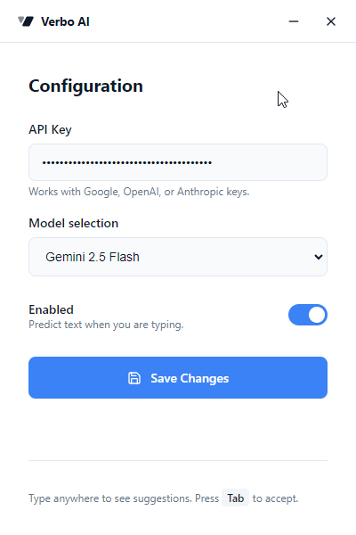

#  Verbo Typing Intelligence

Verbo Typing Intelligence is an Electron desktop app that predicts the next text the user is about to type and shows it as an on-screen overlay. When you press `Tab`, the suggestion is injected into the active application.

## What it does
1. A global key hook detects when the user pauses typing.
2. Windows UI Automation (UIA) reads the current focused text context and caret/selection position.
3. The text context is sent to an AI model to generate a continuation.
4. The suggestion is displayed in a transparent overlay positioned near the caret.
5. On `Tab`, the suggestion is injected into the focused app; the overlay is hidden.

## Key features
- AI-assisted “ghost writer” suggestions for typing
- Overlay shown near the caret (with auto-hide)
- Uses Windows UI Automation to fetch text context and send keystrokes for injection
- Supports multiple AI providers through model selection (Gemini, OpenAI, Anthropic)
- Tray icon with quick actions (Configurations, Quit)



## Prerequisites
- Node.js and npm
- Windows (UI Automation bridge uses PowerShell + Windows UI Automation APIs)
- PowerShell is required (used by the UIA bridge)

## Clone + Setup
1. Clone the repository:
   ```bash
   git clone https://github.com/<your-org>/<your-repo>.git
   cd <your-repo>
   ```
2. Install dependencies:
   ```bash
   npm install
   ```

## Run (development)
```bash
npm run dev
```

Notes:
- `dev` uses `vite-plugin-electron/simple` to run the renderer + Electron main process together.
- Native dependencies may rebuild the first time you run on your machine.

## Build + Package (release)
```bash
npm run build
```

On Windows, installer output is created under `release/<version>/win-*`.

## Configuration (API key + model)
1. Start the app.
2. Open the tray menu and click `Configurations`.
3. Paste your API key and select a model.
4. Click `Save Changes`.

Your configuration is stored using `electron-store` (persisted on the user machine).

Security note:
- Do not commit API keys to the repository. Use the in-app “Configurations” screen.

## Troubleshooting
- Overlay never appears
  - Ensure your API key and model are saved
  - Ensure the “Enabled” toggle is on
  - Ensure the target application has a focused text control that UIA can read
- Suggestions stop or become slow
  - Confirm the selected model/provider is correct
  - Verify the app has network access to the AI provider

## Contributing
See `CONTRIBUTING.md`.

For project behavior expectations, see `CODE_OF_CONDUCT.md`.

For implementation details, see `ARCHITECTURE.md`.

